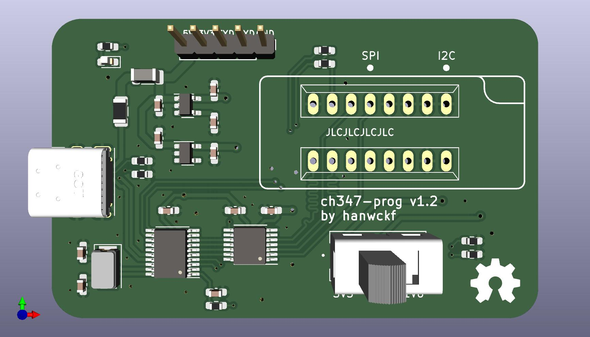
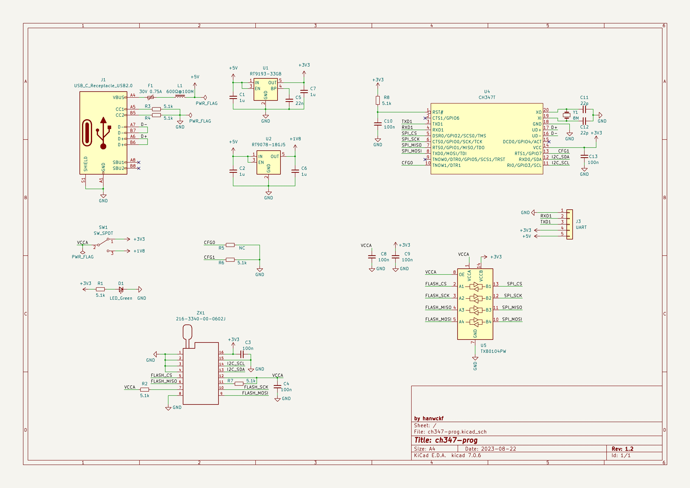

# SPI-NAND Programmer

## About

A SPI-NAND flash programmer software botched together using SPI-MEM and SPI-NAND framework taken from Linux v5.8.

## Features

* Reading/Writing SPI NAND
* Operations with on-die ECC enabled/disabled
* Operations with OOB data included or not
* Skip bad blocks during writing
* Data verification for writing when on-die ECC is enabled

## Supported devices

[WCH CH347](https://www.wch.cn/products/CH347.html)

The default driver.

add the arguments to set CH347 SPI clock (KHz), default is 30000:

```shell
# set CH347 SPI clock to 15MHz
-a 15000
```

[dword1511/stm32-vserprog](https://github.com/dword1511/stm32-vserprog)

add the following arguments to select this driver:

```shell
-d serprog -a /dev/ttyACM0
```

## CH347 programmer hardware

CH347 dual voltage (1.8V/3.3V) SPI/I2C/UART programmer

**Note1: max speed of SPI clock is 30MHz**

**Note2: CFG0 resistor is not connected**

kicad project and gerber file: ch347-hardware/ch347-prog-v1.2-kicad_pro.zip





## Usage
```
spi-nand-prog <operation> [file name] [arguments]

Operations: read/write/erase/scan
Arguments:
 -d <driver>: hardware driver to be used.
 -a <arg>: additional argument provided to current driver.
 -o <offset>: Flash offset. Should be aligned to page boundary when reading and block boundary when writing. default: 0
 -l <length>: read length. default: flash_size
 --no-ecc: disable on-die ECC. This also disables data verification when writing.
 --with-oob: include OOB data during operation.
```
